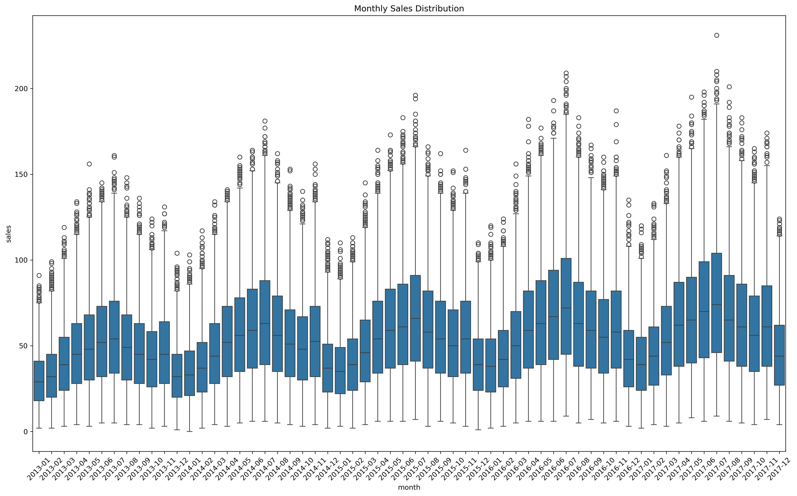
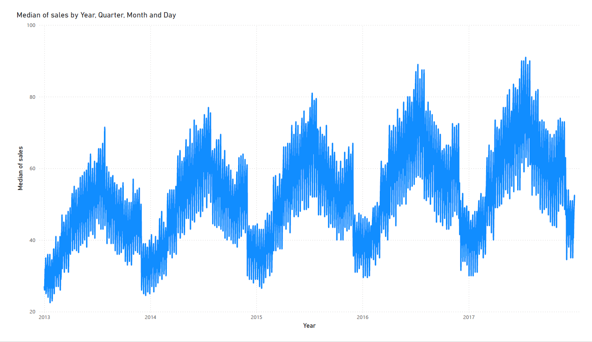
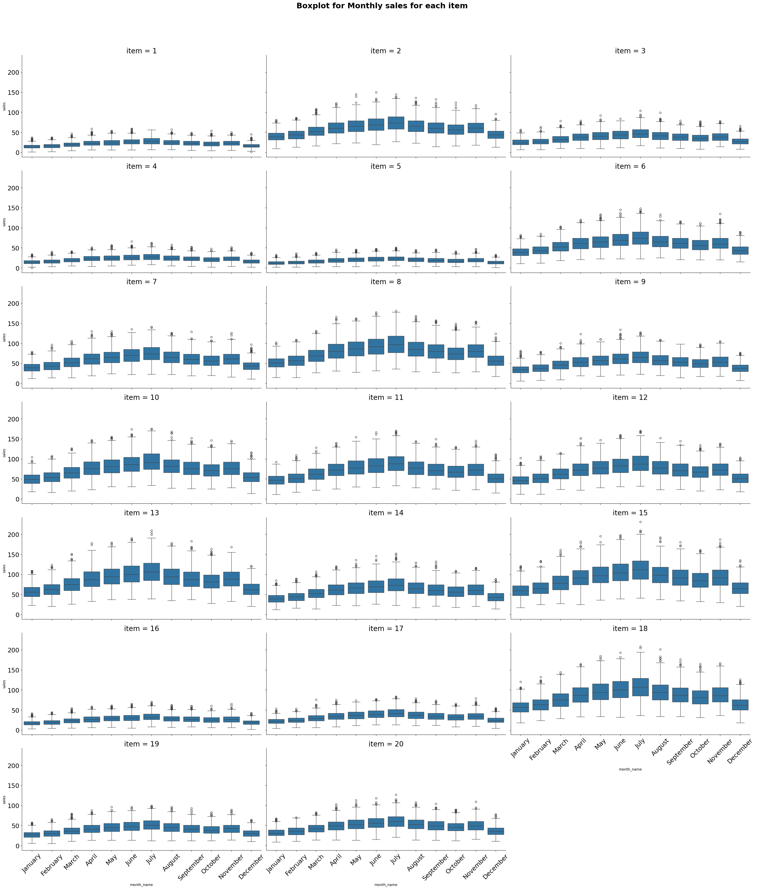
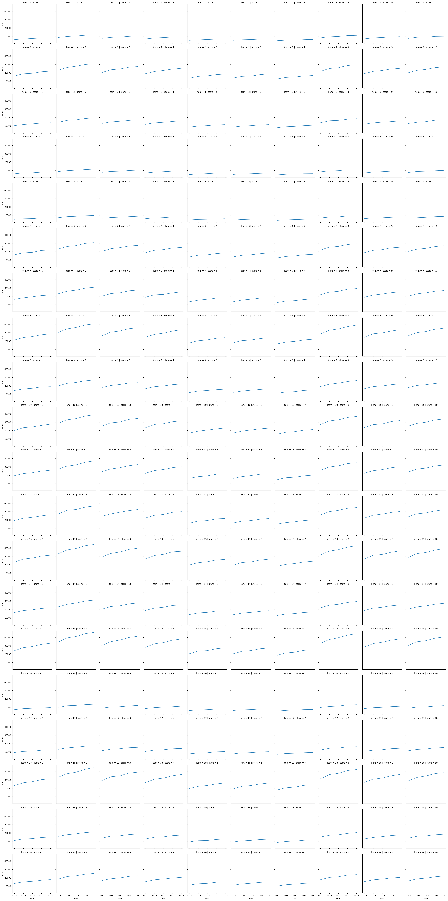

# Store Inventory demand forecasting project

## 🪸 Overview

The dataset is related to store inventory demand forecasting, specifically for tracking the number of items sold at different stores on specific dates.

---

## 🌊 Introduction

This file contains historical data used for training machine learning models to forecast store inventory demand.
Data Fields:
date: The date of the sale data. It represents the specific date when the sales occurred.
store: A unique identifier or ID for each store. This helps in distinguishing between different store locations.
item: A unique identifier or ID for each item that is sold in the stores.
sales: The number of items sold at a particular store on a specific date. This is the target variable for the forecasting task, which you aim to predict for future dates.

---

## 🧭 Data Description

### 📘 1. Store Inventory demand forecasting project
- date: The date of the sale data. It represents the specific date when the sales occurred.
- store: A unique identifier or ID for each store. This helps in distinguishing between different store locations.
- item: A unique identifier or ID for each item that is sold in the stores.
- sales: The number of items sold at a particular store on a specific date. This is the target variable for the forecasting task, - - which you aim to predict for future dates.

### 🧹 2. Data Cleaning & Transformation
- Standardized variables

---

## 📊 Exploratory Data Analysis

Key insights:
- Every Store has an upward trend.
- Yearly and Weekly seasonality exists for every Store.

---

## 🎨 Visualization
- Montly sales distribution of all stores and item over a month.

- Median sales of items has been increasing every year.

- There is yearly seasonality that exists in the sales with outliers every month.
- Median sales on rises for first six months then it it decline till the end of year.

- Median sales of each store rises during first six months then it declines for next six months.

- Sales rate of every item on each store has been rising by yearly.

- Seasonal decomposition of every item by each store indicate a rising trend, yearly seasonality and residual that exists.

---

---

## 🤖 Modeling

- **Techniques:** Grouped time series forecasting model for mulitple stores and items.
- NHiTSModel, GluonTs, Time series probblistic modeling, neuralforecast.
- **Feature Engineering:** Standardised data for modeling.
- **Validation:**Prediction of 3 months of stock in the future.
- **Metrics:** MAE, R square, Root mean squared error, MAPE, SMPE. 

---

## 📈 Results & Discussion

- Stores have weekly and yearly seasonality.
- It has upward trend.
- Metrics: Average metrics of all stores.
  RMSE: 7.793
  MAE: 6.195
  MAPE: 13.086
  rsq: 0.567
---

## ⚙️ Installation & Requirements

**Dependencies:**

pip install pandas numpy matplotlib seaborn darts, pytorch_lightning, GluonTs, neuralforecast.
Python version for gluonTs 3.10
python version for darts and neuralforecast 3.11
