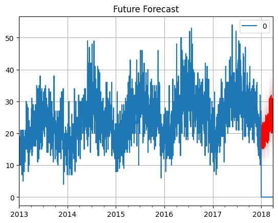
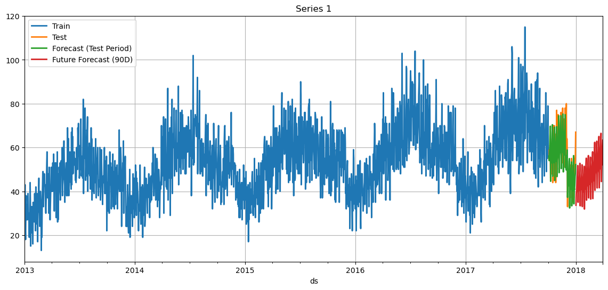

# 📦 Store Inventory Demand Forecasting

A machine learning and deep learning forecasting project designed to predict future inventory demand across multiple stores and products using grouped time series forecasting techniques.

The project analyzes historical sales data, identifies seasonal patterns and trends, and forecasts future demand to support inventory planning and stock optimization.

---

# 🎯 Project Objective

Accurate inventory forecasting helps businesses:

* Reduce stock shortages
* Minimize overstocking costs
* Improve supply chain planning
* Optimize warehouse utilization
* Support demand-driven decision making

This project forecasts future sales volume for every Store–Item combination using advanced time series forecasting models.

---

# 📊 Dataset Overview

The dataset contains historical daily sales transactions.

| Feature | Description                            |
| ------- | -------------------------------------- |
| date    | Date of sales transaction              |
| store   | Unique store identifier                |
| item    | Unique item identifier                 |
| sales   | Number of units sold (Target Variable) |

---

# 🧾 Dataset Characteristics

* Daily observations
* Multiple stores
* Multiple products
* Strong seasonal behavior
* Long-term upward growth trend
* Suitable for grouped/hierarchical forecasting

---

# 🔍 Exploratory Data Analysis

Several exploratory analyses were performed to understand demand patterns.

## Key Findings

### 📈 Trend

* Sales increase steadily over time.
* Every store exhibits long-term growth.

### 🔄 Seasonality

Two major seasonal patterns were identified:

* Weekly seasonality
* Yearly seasonality

### 🏪 Store Behavior

* Sales increase during the first half of the year.
* Sales gradually decline during the second half.

### 📦 Item Behavior

* Most products follow similar yearly seasonal cycles.
* Product demand increases year-over-year.

---

# 📊 Visualizations

## Monthly Sales Distribution

Shows monthly sales variability across all stores and products.


---

## Median Sales Trend

Median sales demonstrate continuous annual growth.


---

## Monthly Sales Distribution by Item

Illustrates yearly seasonality and monthly demand fluctuations.


---

## Monthly Sales Distribution by Store

Highlights store-level seasonal demand patterns.


---

## Growth of Items by Store and Year

Demonstrates increasing sales rates across stores and products.


---

## Seasonal Decomposition

Trend, seasonality, and residual components for Store–Item combinations.


---

# ⚙️ Feature Engineering

The following preprocessing steps were applied:

* Date parsing
* Time series indexing
* Standardization / normalization
* Group-wise forecasting preparation
* Future covariate generation
* Multi-series transformation

---

# 🤖 Forecasting Models

Several forecasting frameworks were evaluated.

## Darts

Models evaluated:

* NHiTS
* NBEATS
* Deep Learning Forecasting Models

Framework:

* Darts
* PyTorch Lightning

---

## GluonTS

Models evaluated:

* DeepAR
* Probabilistic Forecasting Models

Framework:

* GluonTS

---

## NeuralForecast

Models evaluated:

* NHiTS
* NHITS Probabilistic Forecasting
* Deep Learning Forecasting Architectures

Framework:

* NeuralForecast

---

# 🧪 Validation Strategy

Training Period:

* Historical sales data

Forecast Horizon:

* Next 90 days (3 Months)

Evaluation Type:

* Forward Forecasting
* Hold-Out Validation

---

# 📏 Evaluation Metrics

Performance was measured using:

| Metric | Description                              |
| ------ | ---------------------------------------- |
| RMSE   | Root Mean Squared Error                  |
| MAE    | Mean Absolute Error                      |
| MAPE   | Mean Absolute Percentage Error           |
| SMAPE  | Symmetric Mean Absolute Percentage Error |
| R²     | Coefficient of Determination             |

---

# 📈 Model Performance

Average performance across all Store–Item series:

| Metric | Value   |
| ------ | ------- |
| RMSE   | 7.793   |
| MAE    | 6.195   |
| MAPE   | 13.086% |
| R²     | 0.567   |

---

# 🔮 Forecast Results

## GluonTS Forecast

Historical sales and future inventory demand predictions.



---

## Darts Forecast

Forecast generated using Darts forecasting models.



---

# 💡 Business Insights

The analysis reveals:

* Strong weekly demand cycles
* Strong yearly seasonality
* Consistent long-term growth
* Demand peaks during the first half of the year
* Forecasting can significantly improve inventory planning

---

# 📂 Project Structure

```text
Store_Inventory_Forecasting/
│
├── dataset/
│   ├── df.csv
│── analysis.ipynb
|── gluonts_inventory_colab.ipynb
|── neuralforecast.ipynb
|── NHITS_darts.ipynb
│
├── images/
│   ├── monthly_sales_distribution.png
│   ├── Median_of_sales_for_all_stores_and_item.png
│   ├── Boxplot_for_monthly_sales_for_each_item.png
│   ├── boxplot_for_monthly_sales_for_each_store.png
│   ├── growth_of_item_by_store_by_year.png
│   ├── seasonal_decomposition.png
│   ├── gluonts_inventory_prediction.png
│   └── darts_future_forecast.png
│
├── requirements.txt
├── README.md
└── src/
```

---

# 🛠 Installation

## Clone Repository

```bash
git clone https://github.com/RakeshSingh35/Demand-of-each-item-in-every-store.git

cd Demand-of-each-item-in-every-store
```

---

## Install Dependencies

```bash
pip install pandas
pip install numpy
pip install matplotlib
pip install seaborn
pip install scikit-learn
pip install pytorch-lightning
pip install darts
pip install gluonts
pip install neuralforecast
```

---

# 🐍 Python Compatibility

| Framework      | Python Version |
| -------------- | -------------- |
| GluonTS        | 3.10           |
| Darts          | 3.11           |
| NeuralForecast | 3.11           |

---

# 🚀 Future Improvements

Potential enhancements include:

* Hierarchical Forecasting
* Temporal Fusion Transformer (TFT)
* TimeGPT Integration
* Ensemble Forecasting
* Inventory Optimization Layer
* Automated Retraining Pipeline

---

# 📜 License

This project is released under the MIT License.

---

# 👤 Author

Rakesh Kumar Singh

Data Science | Machine Learning | Time Series Forecasting
